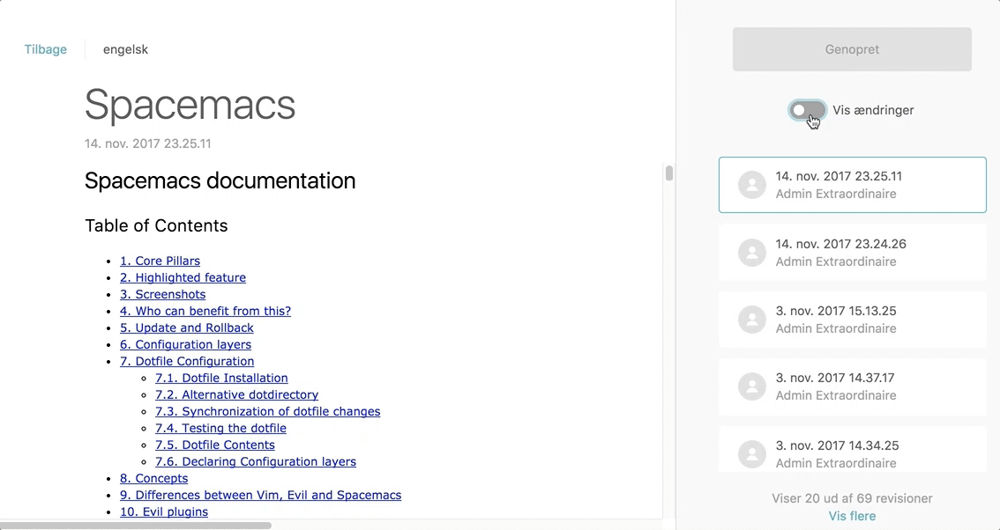
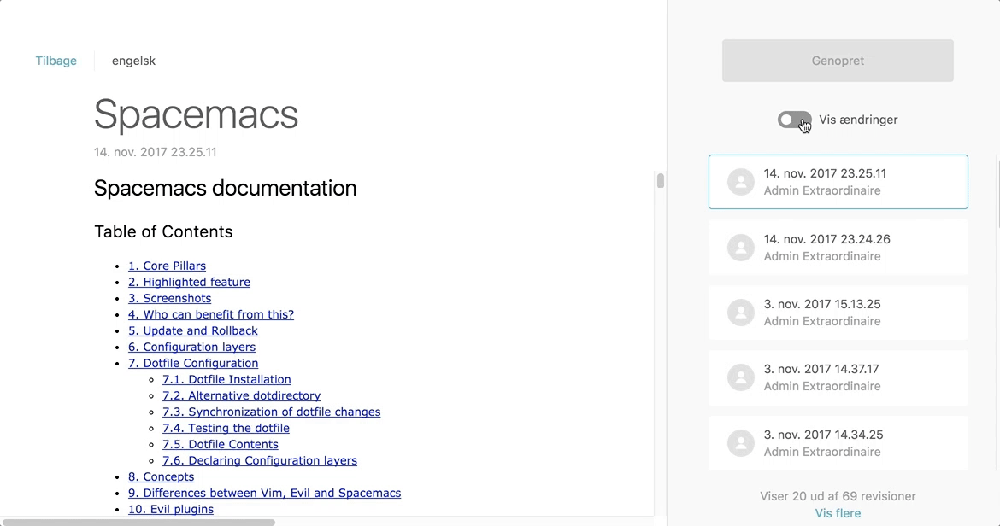

# Ukkonen - Approximate String Matching

[](https://badge.fury.io/js/ukkonen)
[](https://travis-ci.org/sunesimonsen/ukkonen)

This project implements the [Approximate String Matching algorithm by Esko Ukkonen](https://www.sciencedirect.com/science/article/pii/S0019995885800462) extended with ideas from [An Extension of Ukkonen's Enhanced Dynamic Programming ASM Algorith by Hal Berghel and David Roach](http://berghel.net/publications/asm/asm.pdf).

Ukkonen's algorithm is very competitive with the [Levenshtein distance](https://en.wikipedia.org/wiki/Levenshtein_distance) and for longer strings it is much more performant than Levenshtein distance.

In addition to being a competitive alternative to Levenshtein distance, Ukkonen's algorithm also allows you to provide a threshold for the distance which increases the performance even more for texts that are longer than the threshold.

 

Above you can see the different of using Levenshtein distance and Ukkonen's algorithm for matching sub-trees when diffing HTML.

## Install

```sh
npm install --save ukkonen
```

## Usage

You can find the distance between the strings `Ukkonen` and `Levenshtein` the following way:

```js
var ukkonen = require('ukkonen')

assert.equal(ukkonen('Ukkonen', 'Levenshtein'), 8)
```

If you want to limit the distance by a given threshold:

```js
var ukkonen = require('ukkonen')

assert.equal(ukkonen('Ukkonen', 'Levenshtein', 6), 6)
assert.equal(ukkonen('Ukkonen', 'Levenshtein', 10), 8)
```

## Platform support

The library is ES5 and will work with any JavaScript bundler in the browser as well as Node versions with ES5 support.

## Benchmark

I have benchmarked the library against [the fastest Levenshtein distance implementation on NPM](https://github.com/sindresorhus/leven).

```
              Edit distance one word
 245,499 op/s » ukkonen
 502,333 op/s » leven

              Edit distance on sentence with small differences
 767,359 op/s » ukkonen
 139,628 op/s » leven

              Edit distance on paragraphs with small differences
 237,857 op/s » ukkonen
   2,670 op/s » leven

              Edit distance on longer texts with small differences
 112,547 op/s » ukkonen
     683 op/s » leven

              Edit distance on longer texts with many differences
     372 op/s » ukkonen
     416 op/s » leven

              Edit distance on longer texts with small differences and a threshold of 10
 127,725 op/s » ukkonen
     678 op/s » leven

              Edit distance on longer texts with many differences and a threshold of 40
  84,959 op/s » ukkonen
     425 op/s » leven
```

## Acknowledgements

Obviously the authors of the papers describing the algorithm Esko Ukkonen, Hal Berghel and David Roach.

I stole a lot of ideas from [Sindre Sorhus](https://github.com/sindresorhus)'s [leven](https://github.com/sindresorhus/leven) library and I also used it to test my implementation against.

## License

[MIT © Sune Simonsen](./LICENSE)
